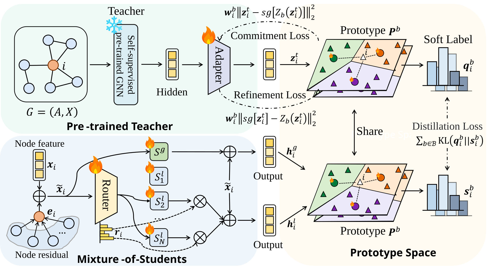

# ProMoS: Prototype-Guided Distillation for Generalist Graph Anomaly Detection



## Datasets
<!-- Dataset available for download [here](https://pan.baidu.com/s/18CK4e2DFHqusMVcyIDwfQw?pwd=ipbu ), extraction code: ipbu -->

|    **Dataset**   | **# Nodes** | **# Edges** | **# Features** | **Avg. Degree** | **# Anomalies** | **% Anomaly** | **Split** |
| :--------------: | ----------: | ----------: | -------------: | --------------: | --------------: | ------------: | :-------: |
|     **Cora**     |       2,708 |       5,429 |          1,433 |            3.90 |             150 |          5.53 |    Test   |
|   **CiteSeer**   |       3,327 |       4,732 |          3,703 |            2.77 |             150 |          4.50 |    Test   |
|      **ACM**     |      16,484 |      71,980 |          8,337 |            8.73 |             597 |          3.62 |    Test   |
|    **PubMed**    |      19,717 |      44,338 |            500 |            4.50 |             600 |          3.04 |   Train   |
|  **BlogCatalog** |       5,196 |     171,743 |          8,189 |           66.11 |             300 |          5.77 |    Test   |
|    **Flickr**    |       7,575 |     239,738 |         12,047 |           63.30 |             450 |          5.94 |   Train   |
|   **Facebook**   |       1,081 |      55,104 |            576 |           50.97 |              25 |          2.31 |    Test   |
|     **Weibo**    |       8,405 |     407,963 |            400 |           48.53 |             868 |         10.30 |    Test   |
|    **Reddit**    |      10,984 |     168,016 |             64 |           15.30 |             366 |          3.33 |    Test   |
|   **Questions**  |      48,921 |     153,540 |            301 |            3.13 |           1,460 |          2.98 |   Train   |
|    **YelpChi**   |      23,831 |      49,315 |             32 |            2.07 |           1,217 |          5.10 |   Train   |
|  **CoAuthor CS** |      18,333 |     163,788 |          6,805 |            8.93 |             600 |          3.27 |    Test   |
| **Amazon Photo** |       7,650 |     238,162 |            745 |           31.13 |             450 |          5.88 |    Test   |
|   **Tolokers**   |      11,758 |     519,000 |             10 |           44.14 |           2,566 |         21.82 |    Test   |
|   **T-Finance**  |      39,357 |  21,222,543 |             10 |          539.23 |           1,803 |          4.58 |    Test   |


## Usage
```python

python main_train.py 

```


## Dependencies
- Python 3.9.22
- torch 2.3.1+cu121
- torchvision 0.18.1+cu121
- torchaudio 2.3.1+cu121
- dgl 0.9.0
- torch-geometric 2.6.1
- torch-scatter 2.1.2+pt23cu121
- torch-sparse 0.6.18+pt23cu121
- torch-cluster 1.6.3+pt23cu121
- torch-spline-conv 1.2.2+pt23cu121
